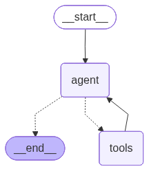

# 🤖 Autonomous Tool Calling with LangGraph

This project demonstrates a multi-turn agentic workflow using **LangGraph** and **Groq**. The assistant can autonomously decide when and which tools to use to fulfill a user request.

## 🌟 Overview

The workflow follows a standard agent-tool-loop pattern:
1.  **Agent**: Uses the LLM (`llama-3.3-70b-versatile`) to determine if a tool call is needed based on the user query.
2.  **Tools Node**: If the agent requests a tool, this node executes the corresponding Python function.
3.  **Loop**: The result is fed back to the agent until a final answer is produced.

## 📊 Graph Visualization

Below is the visual representation of the LangGraph workflow:



## 🛠️ Tools Available

-   **`get_weather`**: Fetches weather details for a specific city.
-   **`saqlain_formula`**: A custom mathematical formula designed for demonstration.

## 🚀 How to Run

1.  Navigate to this directory:
    ```bash
    cd "Autonomous tool calling"
    ```
2.  Ensure you have a `.env` file with your `GROQ_API_KEY`.
3.  Run the application:
    ```bash
    python main.py
    ```

## 🏗️ Technical Stack

-   **Core**: Python, LangGraph
-   **LLM**: Groq (Llama 3.3)
-   **Framework**: LangChain
