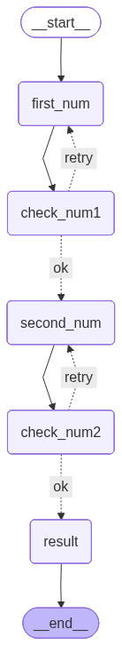

# ➕ Multi-Step Summation Graph

This project demonstrates a structured state machine using **LangGraph** to collect two numbers, validate them, and calculate their sum.

## 🌟 Overview

Unlike a simple script, this workflow uses a directed graph to manage the state of the conversation. It ensures that inputs are valid (non-negative) before proceeding to the next step. If validation fails, the graph "retries" the specific input node.

## 📊 Graph Visualization

The flow of the application is visualized below:



## 🔄 Workflow Steps

1.  **`first_num`**: Prompts the user for the first number.
2.  **`check_num1`**: Validates that the number is non-negative.
    -   If valid: Proceed to `second_num`.
    -   If invalid: Redirect back to `first_num`.
3.  **`second_num`**: Prompts the user for the second number.
4.  **`check_num2`**: Validates that the second number is non-negative.
    -   If valid: Proceed to `result`.
    -   If invalid: Redirect back to `second_num`.
5.  **`result`**: Calculates and displays the final sum.

## 🚀 How to Run

1.  Navigate to this directory:
    ```bash
    cd "a graph to sum 2 numbers"
    ```
2.  Run the application:
    ```bash
    python main.py
    ```

## 🏗️ Technical Stack

-   **Core**: Python, LangGraph
-   **State Management**: Pydantic / TypedDict
