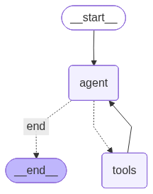

# 🤖 Agentic RAG with Hybrid Pinecone Search

This project demonstrates an agentic Retrieval-Augmented Generation (RAG) workflow using **LangGraph**, **Pinecone hybrid search** (dense + sparse), and a tool-using LLM agent.

## 🌟 Overview

The workflow uses a state machine to orchestrate an LLM agent that can call a retriever tool. The retriever performs hybrid search on Pinecone, combining dense (LLM) and sparse (keyword/BM25) embeddings for robust document retrieval.

## 📊 Graph Visualization

The flow of the application is visualized below:



## 🔄 Workflow Steps

1. **User Input**: The user asks a question.
2. **Agent Node**: The LLM agent receives the question and decides whether to call a tool.
3. **Tool Node**: If needed, the agent calls the `hybrid_retriever_tool`, which performs a hybrid search on Pinecone and returns relevant context.
4. **Agent Node (again)**: The agent receives the tool result and generates the final answer.

## 🚀 How to Run

1. Navigate to this directory:
    ```bash
    cd "agentic rag"
    ```
2. Run the application:
    ```bash
    python main.py
    ```

## 🏗️ Technical Stack

- **Core**: Python, LangGraph, Pinecone, LangChain, Groq LLM
- **Retrieval**: Pinecone hybrid (dense + sparse)
- **Agent**: Tool-using LLM via LangGraph

---

Feel free to explore and modify the workflow for your own agentic RAG experiments!
